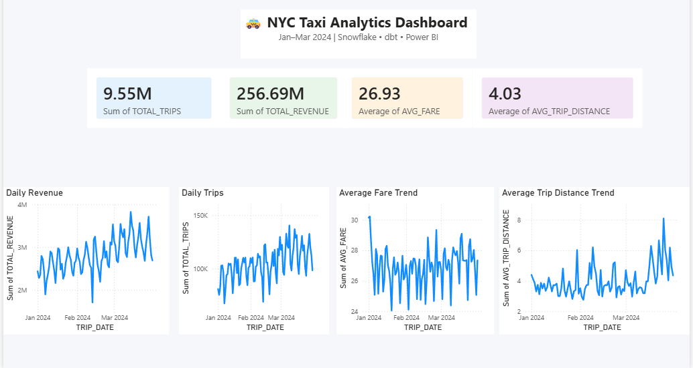
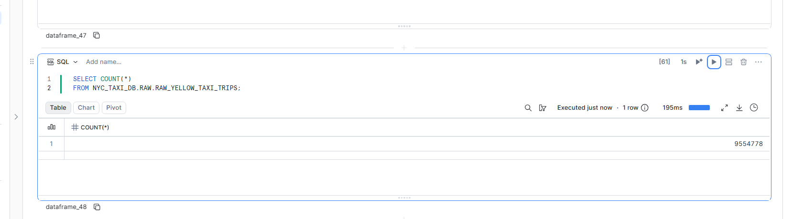
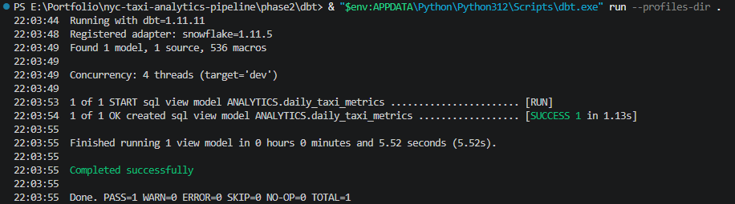

# 🚕 NYC Taxi Analytics Pipeline

## Overview

This project demonstrates an end-to-end cloud data engineering pipeline built using NYC Yellow Taxi trip data.

The project evolved from a traditional local ETL workflow into a modern cloud-based analytics platform using Snowflake, dbt, Prefect, and Power BI.

---

# Project Evolution

### Initial Pipeline

The project originally processed NYC Taxi Parquet files using:

* Python
* Pandas
* SQLAlchemy
* SQL Server Express

Pipeline:

```text
Parquet Files
      ↓
Python ETL
      ↓
SQL Server
      ↓
Analytics Queries
```

### Modern Cloud Pipeline

The architecture was redesigned using cloud-native data engineering tools:

```text
Parquet Files
      ↓
Prefect
      ↓
Snowflake
      ↓
dbt
      ↓
Power BI
```

---

# Architecture

```text
NYC Taxi Parquet Files
          │
          ▼
       Prefect
          │
          ▼
      Snowflake
      RAW Layer
   (9.55M Records)
          │
          ▼
         dbt
 Analytics Layer
      (96 Rows)
          │
          ▼
      Power BI
      Dashboard
```

---

# Dataset

Source: NYC Taxi & Limousine Commission (TLC)

Files Processed:

* yellow_tripdata_2024-01.parquet
* yellow_tripdata_2024-02.parquet
* yellow_tripdata_2024-03.parquet

Total Records Processed:

```text
9,554,778 Rows
```

---

# Technology Stack

### Data Engineering

* Python
* Pandas
* PyArrow
* Prefect
* Snowflake
* dbt

### Analytics & Visualization

* Power BI

### Version Control

* Git
* GitHub

### Security

* Environment Variables
* python-dotenv
* dbt env_var()

---

# Snowflake Data Warehouse

### Database

```sql
NYC_TAXI_DB
```

### Schemas

```sql
RAW
ANALYTICS
```

### Warehouse

```sql
COMPUTE_WH
```

---

# Data Loading

Parquet files are loaded into:

```sql
NYC_TAXI_DB.RAW.RAW_YELLOW_TAXI_TRIPS
```

Final Row Count:

```sql
SELECT COUNT(*)
FROM NYC_TAXI_DB.RAW.RAW_YELLOW_TAXI_TRIPS;
```

Result:

```text
9,554,778 Rows
```

---

# Prefect Orchestration

A Prefect flow was implemented to automate:

1. Snowflake table refresh
2. January data load
3. February data load
4. March data load
5. dbt model execution

Pipeline Flow:

```text
Load January
      ↓
Load February
      ↓
Load March
      ↓
Run dbt
      ↓
Refresh Analytics Layer
```

---

# dbt Analytics Layer

Created analytics model:

```sql
DAILY_TAXI_METRICS
```

Metrics generated:

* Trip Date
* Total Trips
* Average Trip Distance
* Average Fare
* Total Revenue

Example Transformation:

```sql
SELECT
    CAST(TPEP_PICKUP_DATETIME AS DATE) AS TRIP_DATE,
    COUNT(*) AS TOTAL_TRIPS,
    ROUND(AVG(TRIP_DISTANCE), 2) AS AVG_TRIP_DISTANCE,
    ROUND(AVG(TOTAL_AMOUNT), 2) AS AVG_FARE,
    ROUND(SUM(TOTAL_AMOUNT), 2) AS TOTAL_REVENUE
FROM RAW_YELLOW_TAXI_TRIPS
GROUP BY CAST(TPEP_PICKUP_DATETIME AS DATE)
```

---

# Power BI Dashboard

The Power BI dashboard provides:

### KPI Metrics

* Total Trips
* Total Revenue
* Average Fare
* Average Trip Distance

### Trend Analysis

* Daily Trips Trend
* Daily Revenue Trend
* Average Fare Trend
* Average Trip Distance Trend

---

# Dashboard Preview

## Power BI Dashboard



## Snowflake Validation



## dbt Successful Run



---

# Security Improvements

Removed hardcoded credentials and implemented environment-based configuration.

Example:

```python
user=os.getenv("SNOWFLAKE_USER")
password=os.getenv("SNOWFLAKE_PASSWORD")
account=os.getenv("SNOWFLAKE_ACCOUNT")
```

Implemented:

* .env configuration
* python-dotenv
* dbt env_var()
* GitHub secret cleanup

---

# Snowflake Time Travel Recovery

During development, an accidental:

```sql
TRUNCATE TABLE RAW_YELLOW_TAXI_TRIPS;
```

removed all loaded data.

The dataset was successfully recovered using Snowflake Time Travel and table cloning, restoring:

```text
9,554,778 Records
```

This demonstrated cloud data recovery and operational troubleshooting skills.

---

# Results

| Metric                   | Value     |
| ------------------------ | --------- |
| Records Processed        | 9,554,778 |
| Months Loaded            | 3         |
| Cloud Warehouse          | Snowflake |
| Orchestration Tool       | Prefect   |
| Transformation Tool      | dbt       |
| Dashboard Tool           | Power BI  |
| Analytics Rows Generated | 96        |

---

# Resume Impact

Key achievements:

* Built an end-to-end cloud data engineering pipeline processing 9.55M+ NYC Taxi records.
* Automated ingestion and transformation workflows using Prefect and dbt.
* Developed Snowflake RAW and ANALYTICS layers.
* Built Power BI dashboards for trip volume, revenue, fare, and distance analytics.
* Recovered a production dataset using Snowflake Time Travel after accidental data loss.

---

# Future Enhancements

* Docker Containerization
* GitHub Actions CI/CD
* Incremental dbt Models
* Data Quality Testing
* Automated Scheduling

---

# Author

**Kruthika Kadurhalli Raghu**

Graduate Student – Data Science
Arizona State University

GitHub: https://github.com/kruthika-kr


GitHub: https://github.com/kruthika-kr
